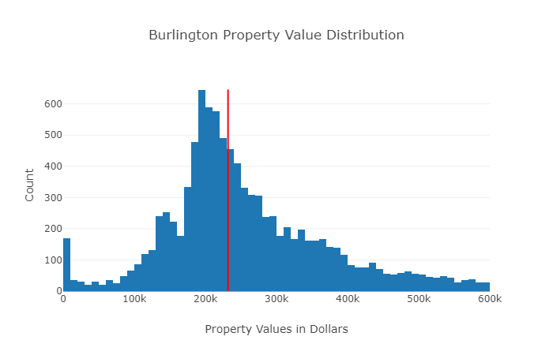
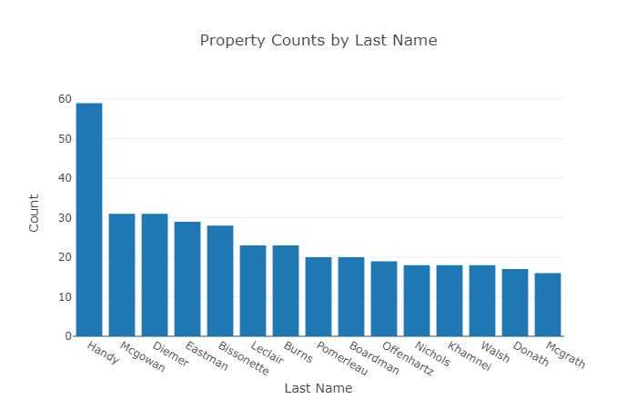
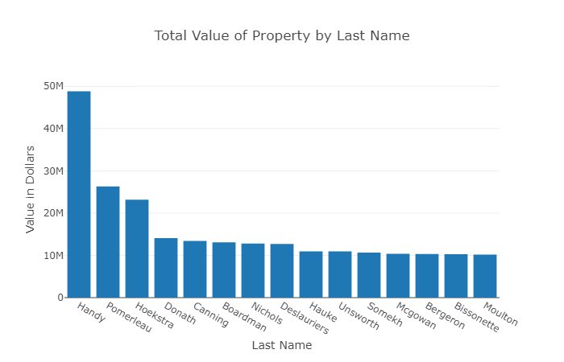
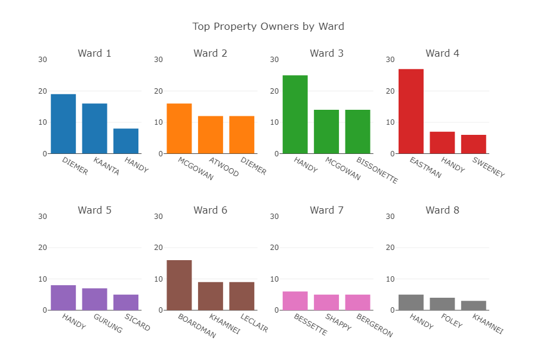

# Who Owns Burlington?
Analysis and Dashboarding for Burlington, VT Real Estate
# Live Dashboard
http://burlington-app.herokuapp.com
# Motivation
The city of Burlington, VT provides useful open data on property ownership through its online portal. However, because it is a common practice for an LLC or other business entity to be listed as the owner of a property, it can be difficult to figure out exactly how many properties are owned by an individual or group.

To address this, I performed an analysis of last names associated with properties in Burlington, VT, combining matches from directly listed property owners and principals of companies listed as owners with the help of Felippe Rodrigues at VTDigger. I geocoded the results and tagged each property with its associated city ward, enabling statistical and geospatial analysis through a custom-built dashboard and other statistical software.

The resulting analysis revealed that there are in fact a small group of particularly dominant families and real estate agencies/moguls that own a disproportionate amount of property in Burlington, VT. Some have registered these properties in a straightforward way, while others have registered them under many different LLCs or other types of organizations.

I additionally found that some ownership groups tend to focus their efforts on particular geographic clusters, mass purchasing property and land in a single area. A closer look at this data could reveal future development plans in the city of Burlington.
# Notebooks of Interest
1. [Full Project](notebooks/final_project.ipynb)
2. [Data Loading and Scrubbing](notebooks/final_project.ipynb)

# Figures of Interest

# Conclusions

* The Handy family is the dominant real estate power in Burlington, VT, owning both the most numerous and most valuable properties of any independent non-institutional property owner in VT.
* Several super-owners of real estate are especially dominant in a single chosen city ward. Specifically:
    * Ward 3: Handy with 25 properties
    * Ward 4: Eastman with 27 properties
    * Ward 6: Boardman with 16 properties
* Diemer nears the top of the super-owner list by the numbers, but many of their units are located inside of a single building. This is not the case for other super-owners.
* While Handy leads the pack in terms of total dollars worth owned, Pomerleau and Hoekstra are also major players when it comes to expensive real estate
* Eastman is a huge outlier when it comes to owning many inexpensive properties. This appears to be because of many purchases of empty lots for development on Appletree Point Road. I can only surmise he has big plans for the area.
* Among super-owners, Pomerleau, Donath, and Handy are notable for focusing on higher-end properties, while Bissonette largely focuses on more modest opportunities.
* Walsh and McGrath also own many less expensive homes, but it is unclear that this is a coordinated buying plan. They may just be large families of single homeowners.
* For similar reasons, Brown, Green, White et al should be excluded from analysis except for by regional experts
